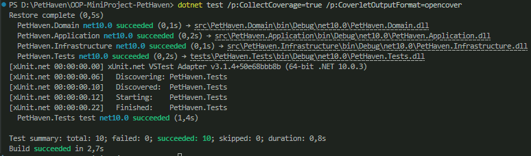

# Матриця відповідності вимог та тестів (Test Matrix)

| Ідентифікатор Use Case | Опис сценарію використання | Метод тестування (Клас та назва тесту) | Статус |
| :--- | :--- | :--- | :--- |
| **UC-1** | Заселення тварини (Check-In) | `UnitTests.BookRoomAsync_RoomIsOccupied_ThrowsBusinessRuleException` | Успішно |
| **UC-1.1** | Валідація гранічного віку | `UnitTests.Pet_Constructor_InvalidAge_ThrowsBusinessRuleException` | Успішно |
| **UC-2** | Виселення тварини (Check-Out) | `UnitTests.Booking_CancelCompletedBooking_ThrowsInvalidOperationException` | Успішно |
| **UC-4** | Звіти та LINQ-аналітика | `UnitTests.AnalyticsService_GetTotalRevenue_CalculatesCorrectSum` | Успішно |
| **Fault-01** | Пошкодження JSON-сховища | `IntegrationTests.LoadAsync_FileIsCorrupted_ReturnsEmptyCollection_FaultHandling` | Успішно |

